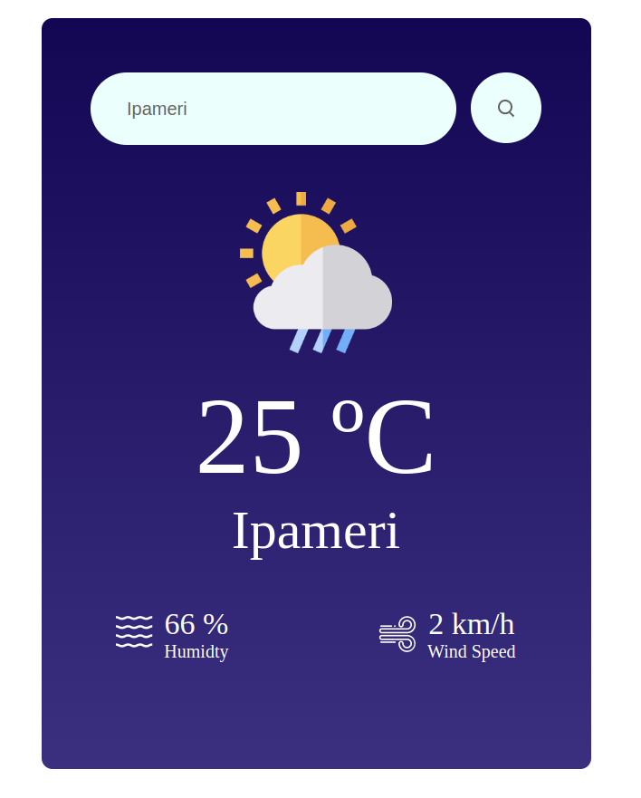

<h1 align="center"> React Weather App ☁️ </h1>

## 💻 Descrição

Uma simples aplicativo de meteorologia. Nele é possível consultar a temperatura, umidade e velocidade do vento com base nos dados fornecidos por uma API.
## 🚀 Tecnologias

Esse projeto foi desenvolvido com as seguintes tecnologias:

- [React](https://react.dev/)

## 🖥️ Screenshots

 

---

Feito com ❤️.